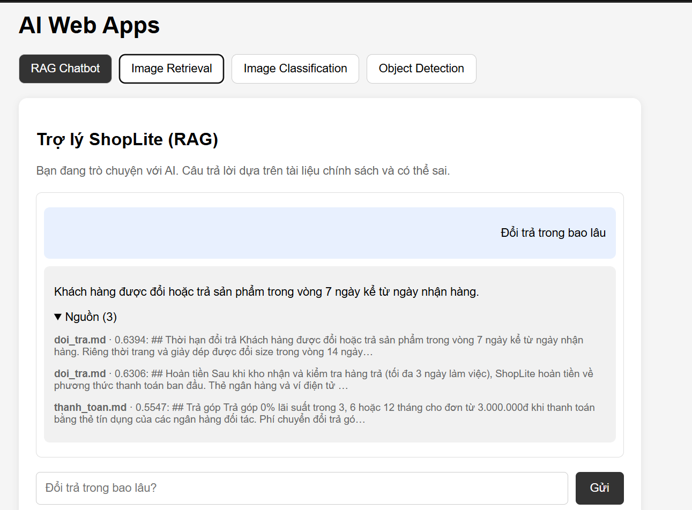
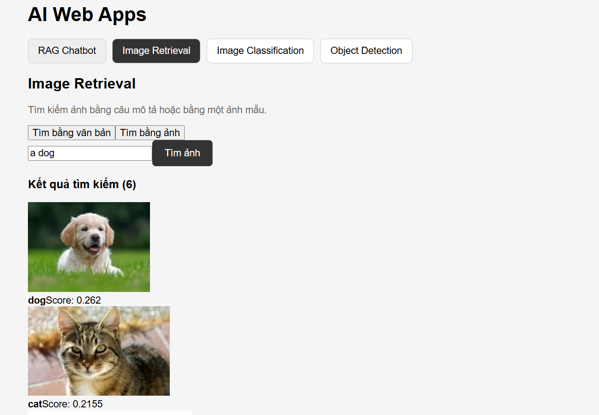
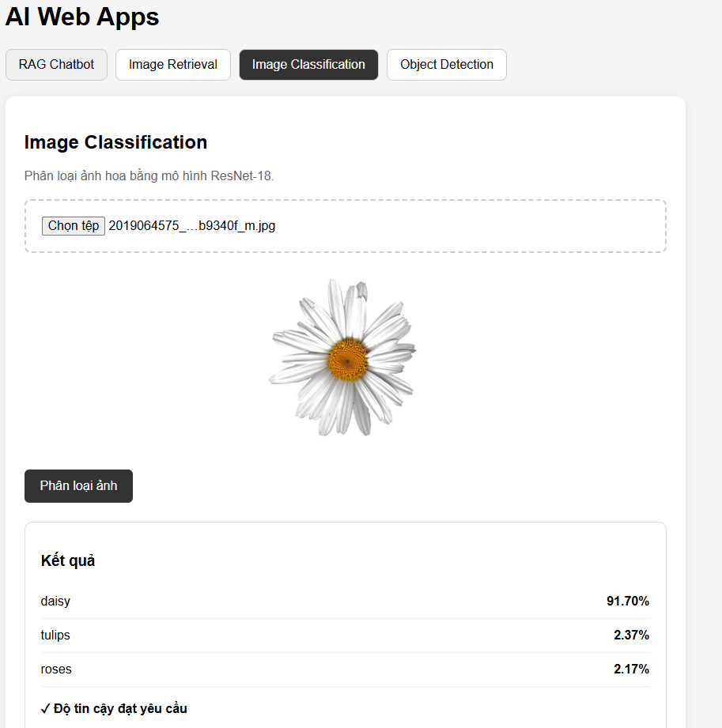
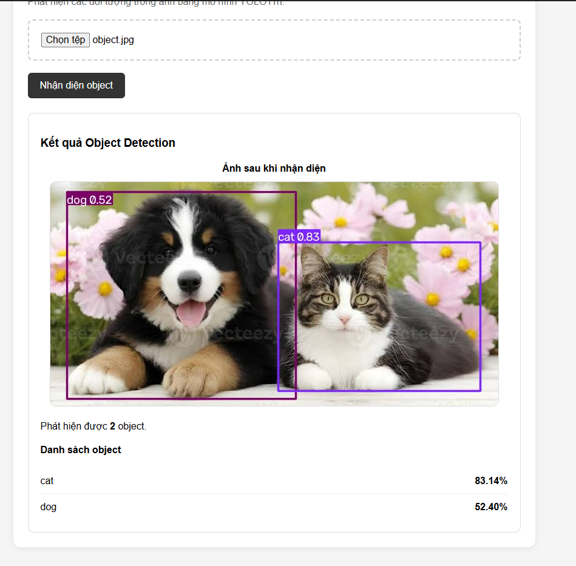

# AI Web Apps

Website tích hợp 4 chức năng AI:

1. Image Classification
2. Object Detection
3. Image Retrieval
4. RAG Chatbot

Project được xây dựng bằng React + Vite ở frontend và FastAPI ở backend.

---

## 1. Các chức năng

### 1.1 Image Classification

Phân loại ảnh hoa bằng mô hình:

- Model: ResNet-18
- Dataset: TF Flowers
- Số lớp: 5
  - daisy
  - dandelion
  - roses
  - sunflowers
  - tulips

Frontend cho phép người dùng upload ảnh và nhận kết quả Top-K cùng confidence.

API:

```text
POST /api/classify
```

---

### 1.2 Object Detection

Phát hiện các đối tượng trong ảnh bằng:

- Model: YOLO11n
- Dataset/model pretrained: COCO
- Runtime: Ultralytics

Kết quả gồm:

- Tên object
- Confidence
- Bounding box

API:

```text
POST /api/detect
```

Giao diện hiển thị ảnh sau khi YOLO vẽ bounding box.

---

### 1.3 Image Retrieval

Tìm kiếm ảnh bằng:

- CLIP ViT-B/32
- FAISS
- Text → Image Retrieval
- Image → Image Retrieval

API:

```text
POST /api/search/text
POST /api/search/image
```

Hệ thống trả về các ảnh có độ tương đồng cao với query.

---

### 1.4 RAG Chatbot

Chatbot trả lời câu hỏi dựa trên tài liệu chính sách ShopLite.

Pipeline:

```text
Question
   ↓
MiniLM Embedding
   ↓
FAISS Retrieval
   ↓
Relevant Documents
   ↓
Qwen2.5-0.5B-Instruct
   ↓
Answer + Sources
```

Model:

```text
LLM:
Qwen/Qwen2.5-0.5B-Instruct

Embedding:
sentence-transformers/paraphrase-multilingual-MiniLM-L12-v2

Vector Search:
FAISS
```

API:

```text
POST /api/chat
```

Chatbot sử dụng Server-Sent Events (SSE) để stream câu trả lời.

---

## 2. Kiến trúc hệ thống

```text
                    React / Vite
                         │
                         │ HTTP
                         ▼
                    FastAPI
                         │
        ┌────────────────┼────────────────┐
        │                │                │
        ▼                ▼                ▼
 Classification     Detection        Retrieval
   ResNet-18          YOLO11n        CLIP + FAISS
        │                │                │
        └────────────────┼────────────────┘
                         │
                         ▼
                    RAG Chatbot
                 MiniLM + FAISS
                         │
                         ▼
               Qwen2.5-0.5B-Instruct
```

---

## 3. Công nghệ sử dụng

| Thành phần | Công nghệ |
|---|---|
| Frontend | React |
| Build tool | Vite |
| Backend | FastAPI |
| Classification | ResNet-18 |
| Detection | YOLO11n |
| Image Retrieval | CLIP ViT-B/32 |
| Vector Search | FAISS |
| RAG Embedding | MiniLM |
| RAG LLM | Qwen2.5-0.5B-Instruct |
| Runtime | Python + PyTorch |
| Device | CPU |

---

## 4. Cấu trúc project

```text
AI-Web-Apps/
│
├── api/
│   └── main.py
│
├── core/
│   ├── classifier.py
│   ├── detector.py
│   ├── retrieval.py
│   └── llm.py
│
├── web/
│   └── src/
│       ├── features/
│       │   ├── Chat.jsx
│       │   ├── Search.jsx
│       │   ├── Classify.jsx
│       │   └── Detect.jsx
│       │
│       ├── api.js
│       ├── App.jsx
│       ├── main.jsx
│       └── style.css
│
├── data/
│   ├── kb/
│   ├── images/
│   └── flowers/
│
├── artifacts/
│   ├── classifier/
│   ├── detector/
│   └── retrieval/
│
├── config.py
├── requirements.txt
├── .gitignore
└── README.md
```

---

## 5. API

### Health

```text
GET /api/health
```

Kiểm tra trạng thái các model.

### Classification

```text
POST /api/classify
```

### Object Detection

```text
POST /api/detect
```

### Text → Image Retrieval

```text
POST /api/search/text
```

### Image → Image Retrieval

```text
POST /api/search/image
```

### RAG Chatbot

```text
POST /api/chat
```

---

## 6. Cách chạy

### Backend

```powershell
cd D:\AI-Web-Apps

.\.venv\Scripts\Activate.ps1

$env:ENABLED_MODELS="llm,retrieval,classifier,detector"

python -m uvicorn api.main:app --reload
```

Backend:

```text
http://127.0.0.1:8000
```

Kiểm tra:

```text
http://127.0.0.1:8000/api/health
```

---

### Frontend

Mở PowerShell khác:

```powershell
cd D:\AI-Web-Apps\web

npm install

npm run dev
```

Frontend:

```text
http://localhost:5173
```

---

## 7. Giao diện

### RAG Chatbot



### Image Retrieval



### Image Classification



### Object Detection



---

## 8. Kết quả

Website tích hợp thành công 4 chức năng:

- [x] Image Classification
- [x] Object Detection
- [x] Image Retrieval
- [x] RAG Chatbot

Backend health check:

```text
llm=True
retrieval=True
classifier=True
detector=True
```

---

## 9. Nhóm thực hiện

- Nguyễn Trung Đức - 24100339: Image Classification
- Phạm Duy Khánh - 22010352: Object Detection
- Đỗ Đăng Dương - 24100293: Image Retrieval
- Mai Tiến Đạt - 24100276: RAG Chatbot + tích hợp hệ thống

---

## 10. Lưu ý

Project chạy mặc định trên CPU.

Các model AI được sử dụng:

```text
ResNet-18
YOLO11n
CLIP ViT-B/32
Qwen/Qwen2.5-0.5B-Instruct
sentence-transformers/paraphrase-multilingual-MiniLM-L12-v2
```